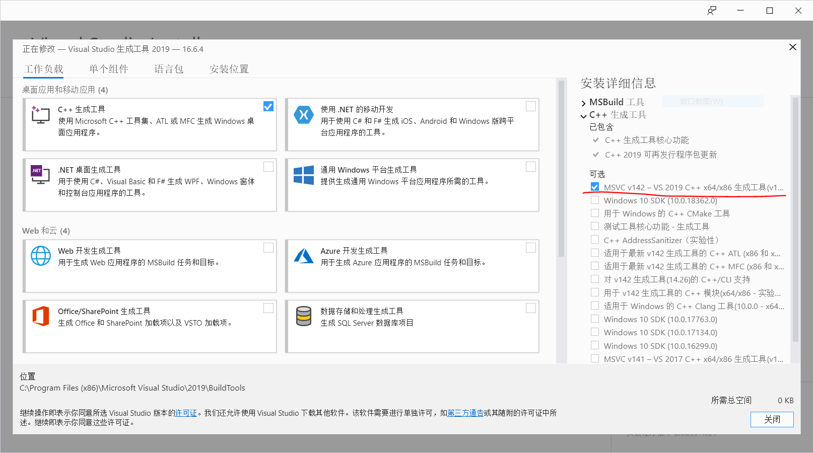

### rust demo

### hello_rust
执行下面的语句，可以看到rust编译输出的"Hello，rust!"

1. `cargo new hello_rust` 
- 新建一个hello_rust项目
2. `cd hello_rust`
- 进入项目文件
3. `cargo build` 
- 编译生成项目
- cargo build之前要安装MSVC生成工具
  - [链接:https://visualstudio.microsoft.com/zh-hans/visual-cpp-build-tools/](https://visualstudio.microsoft.com/zh-hans/visual-cpp-build-tools/)
  - 需要安装的内容：
  - 参考内容：[链接：https://blog.csdn.net/coolsoloist/article/details/106425656](https://blog.csdn.net/coolsoloist/article/details/106425656)
4. `./target/debug/hello_rust.exe`
- 运行编译后的可执行文件
> 注：可以使用`cargo run`直接编译运行项目(等同第3、4步)
5. `cargo build --release`
- 发布最终项目
